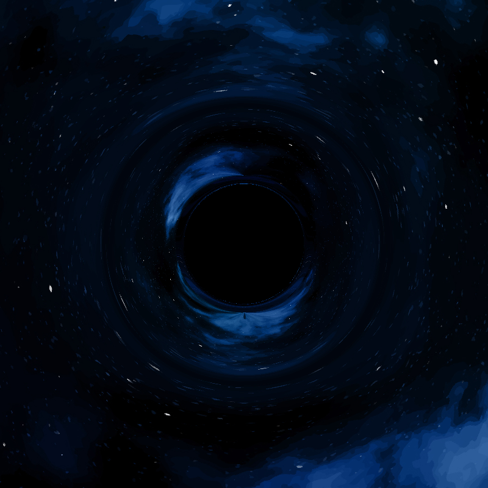
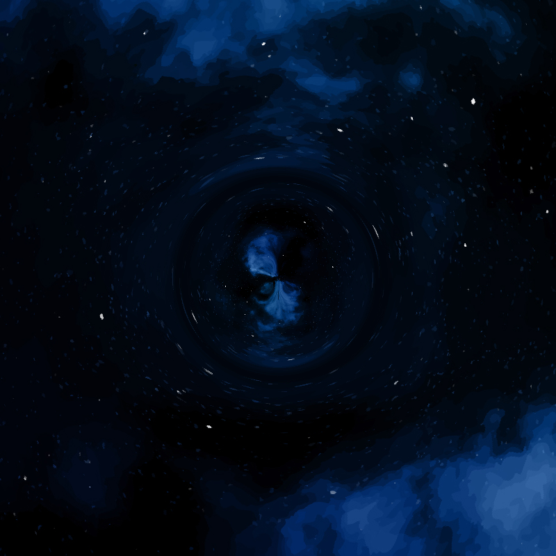
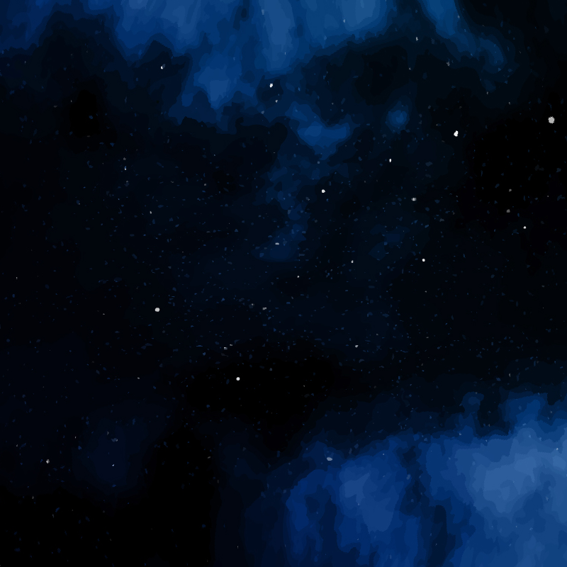

# GRTracing

This is a julia package that renders spacetimes.
It ought to work in arbitrary dimensions but I am first focusing on getting the package to
work in spatial dimensions of 3D and 2D.

# Example

Here are example renders of a unmoving black hole (Schwarzschild black hole), Unphysical "blob/soft" matter metric, and flat
space (Minkowski).

## Unmoving Black Hole

## Soft Blob Spacetime

## Empty Space

# Attributions

Test Image `assets/test_sky_1.png` by <a href="https://www.freepik.com/free-vector/watercolor-galaxy-background_21449238.htm#query=night%20sky%20texture&position=2&from_view=keyword&track=ais_user&uuid=267f8109-e26a-465f-bacf-f60cfdd5144d">Freepik</a>
